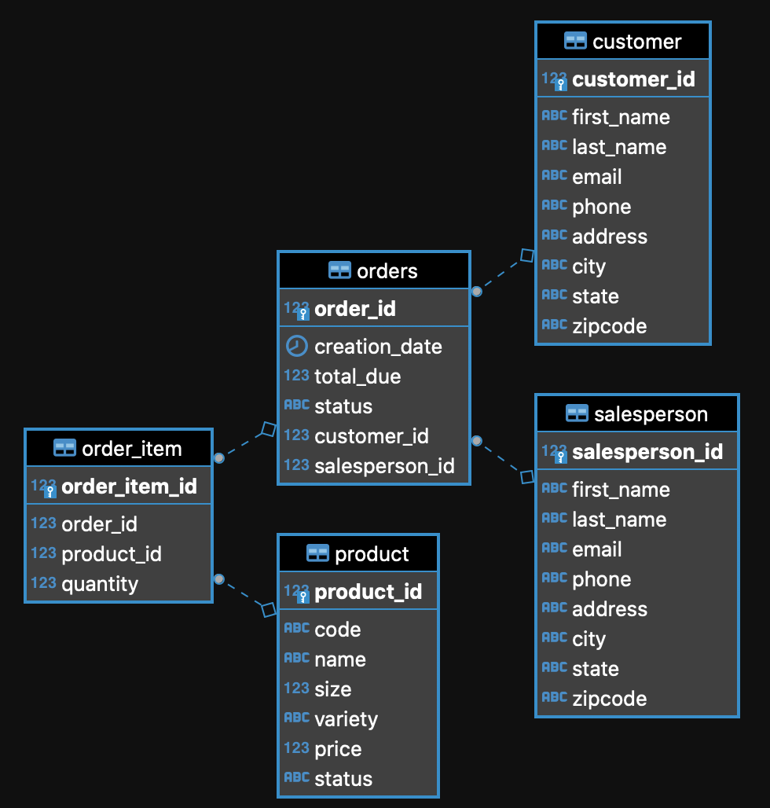

# Introduction
The purpose of the Java JDBC app is to learn about the SQL libraries available in Java. It uses a course taken from Lynda that creates an example database which is then modified and queried for information. The database models a company's sales: the items ordered, the customer, and the salesperson.

# Implementaiton
## ER Diagram


## Design Patterns
The Data Access Object (DAO) pattern is a structural pattern that allows us to isolate the application layer from the persistence layer using an abstract API. This abstract API is to hide from the application all the complexities involved in performing CRUD operations in the underlying storage mechanism. When we are dealing with a centralized system or multiples table joins, DAO is an excellent choice.

The repository design pattern is an abstraction of a collection of objects. When dealing with a distributed system or the application is horizontally scalable, the repository design pattern is a good choice.

# Test
- Database management tool: DBeaver
- RDBMS: Postgres
- GET INFORMATION BY ORDER ID
```postgres-psql
   SELECT c.first_name, c.last_name, c.email, o.order_id, o.creation_date, 
   o.total_due, o.status, s.first_name, s.last_name, s.email, ol.quantity, p.code, p.name, p.size,
   p.variety, p.price FROM orders o JOIN customer c on o.customer_id = c.customer_id JOIN salesperson s
   on o.salesperson_id = s.salesperson_id JOIN order_item ol on ol.order_id = o.order_id JOIN product p 
   on ol.product_id = p.product_id where o.order_id = 1000
```
- RESULTS

|first_name|last_name|email|order_id|creation_date|total_due|status|s.first_name|s.last_name|s.email|ol.quantity|p.code|p.name|p.size|p.variety|p.price|
|:---:|:---:|:---:|:---:|:---:|:---:|:---:|:---:|:---:|:---:|:---:|:---:|:---:|:---:|:---:|:---:|
|Angela|Crawford|acrawford8p@com.com|1000|2016-05-14 00:00:00|118.22|paid|Edward|Kelley|ekelleyu@hplussport.com|17|MWLEM32|Mineral|Water|32|Lemon-Lime|3.69|
|Angela|Crawford|acrawford8p@com.com|1000|2016-05-14 00:00:00|118.22|paid|Edward|Kelley|ekelleyu@hplussport.com|31|MWCRA20|Mineral|Water|20|Cranberry|1.79|

- GET CUSTOMER INFO BY CUSTOMER ID
```postgres-psql
SELECT customer_id, first_name, last_name, 
email, phone, address, city, state, zipcode FROM customer WHERE customer_id=1000SELECT customer_id, first_name, last_name,                                                                            email, phone, address, city, state, zipcode FROM customer WHERE customer_id=1000
```

- RESULTS

|customer_id|first_name|last_name|email|phone|address|city|state|zipcode|
|:---:|:---:|:---:|:---:|:---:|:---:|:---:|:---:|:---:|
|1000|Victor|Woods|vwoodsp0@blogtalkradio.com|(786)720-8933|00 Bunting Terrace|Miami|FL|33164|