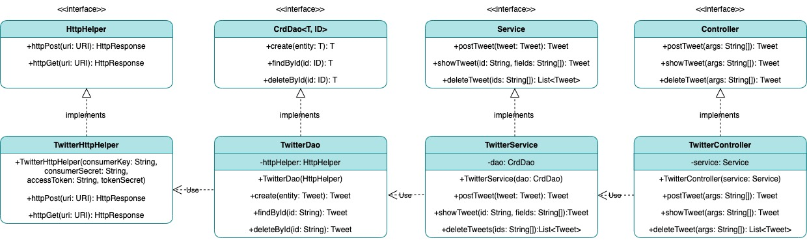

# Introduction
This project is about a Java application using Twitter REST API. This Java application allows users to post, get, and delete tweets from Twitter with a developer account. It uses MVC(Model-View-Controller) design pattern to manage the code structure. The Rest APIs interact with Twitter, Maven and Spring as dependency managers, JUnit and Mockito for testing, and Docker to create a container for the app.

# Quick Start
### MAVEN
#### 1.Package jar file using maven:
```shell script
mvn clean package
```
#### 2. Run jar file with Java CLI:
```shell script
java -jar ./target/twitter-1.0-SNAPSHOT.jar "post|show|delete" "[options]"
```
### DOCKER
#### 1.Create a local image:
```shell script
# login docker
docker_user=your_docker_id
docker login -u ${docker_user}

#build docker image
docker build -t ${docker_user}/twitter

docker run --rm \
-e consumerKey=${consumerKey} \
-e consumerSecret=${consumerSecret} \
-e accessToken=${accessToken} \
-e tokenSecret=${tokenSecret} \
${docker_user}/twitter "post|show|delete" "[options]"
```
#### 2. Push your image to Docker Hub:
```shell script
docker push ${docker_user}/twitter
```
### APP USAGE
This app allows 3 commands: `post`, `show`, and `delete`
```shell script
# Post a tweet with the given text and coordinates(latitude:longitude)
twitter post "text" "lat:lon"

# Show a tweet with the tweet id from post
twitter show id_str

# Delete a list of tweets with tweet ids
twitter delete "id1, id2, id3"
```

# Design
The application follows the MVC architecture. Models are POJO's transformed from JSON responses. The views are the JSON data retrieved from requests.
## UML diagram

### Components
#### app/main
TwitterCLIApp is the entry point of this application. In this component we create all other classes/components, accept the arguments that are passed by users and perform the execution. There are multiple variations to manage dependency injection.
- `TwitterCLIApp`
- `TwitterCLIBean`
- `TwitterCLIComponentScan`
- `TwitterCLISpringBoot`
#### Controller
TwitterController is an implementation of the Controller interface. The Controller object gets the user input and calls the appropriate corresponding service method.
#### Service
TwitterService is an implementation of the Service interface. This Service contains the code's business logic, which consists of verifying that the arguments for the command are valid.
- The character length is less than 140 characters.
- The latitude and longitude are appropriate values.

TwitterService is dependent on TwitterDAO and is used as a dependency in the Controller interface.
#### DAO
TwitterDao is an implementation of the CrdDao interface. Dao(Data Access Object) manages data from external storage, but Dao controls the data sent to and retrieved from the Twitter API. This class is dependent on the HttpHelper and is used as a dependency in the Service interface.
#### HttpHelper
TwitterHttpHelper is an implementation of the HttpHelper. It generates the corresponding URI and also sends the HTTP request by using Twitter REST API.
## Models
The Tweet class is a simplified version of the Tweet JSON that the Twitter API returns in POJO form. Models are converted from JSON to POJO using the Jackson Library.
```json
{ 
  "created_at":"Mon Apr 05 15:00:37 +0000 2021",
  "id":1379086580669952000,
  "id_str":"1379086580669952000",
  "text":"test",
  "entities":{
    "hashtags":[],
    "user_mentions":[]
  },
  "coordinates":null,
  "retweet_count":0,
  "favorite_count":0,
  "favorited":false,
  "retweeted":false
}
```
- `created_at`: Time of Tweet creation
- `id`: Tweet id(integer)
- `id_str`: Tweet id(string)
- `text`: Tweet text
- `entities`: Contains miscellaneous Tweet entities, like user mentions and hashtags
- `coordinates`: Geographical location (latitude:longitude)
- `retweet_count`: Number of times this tweet was retweeted
- `favorite_count`: Number of times this tweet was favorited
- `favorited`: Boolean of whether the tweet was favorited
- `retweeted`: Boolean of whether the tweet was retweeted

## Spring
Many setups were required to properly initialize the app because of the dependency relationships between classes. This can potentially introduce errors. Instead of manually setting up dependencies, the app uses Spring to manage dependencies within the app. Dependency Injection was handled using the Spring Framework, and Using Spring saves time and reduces writing code.

# Test
Junit: Junit 4 is used to test each class independently. Test-Driven Development was followed to develop this application.
Mockito: If classes had any dependencies, the Mockito framework was used to mock the dependency's behaviours.

## Deployment
```shell script
#Create dockerfile
cat > Dockerfile << EOF
FROM openjdk:8-alpine
COPY target/twitter*.jar /usr/local/app/grep/lib/twitter.jar
ENTRYPOINT ["java","-jar","/usr/local/app/grep/lib/twitter.jar"]
EOF

#Package java app 
mvn clean package

#build a new docker image locally
docker build -t ${docker_user}/twitter .

#push your image to Docker Hub
docker push ${docker_user}/twitter
```

# Improvements
- Remove some hardcoded, repeated strings from error message to reduce redundancy.
- Implement PUT feature to update an existing tweet from user.
- Connecting Database to set up key values, also check duplicated values.