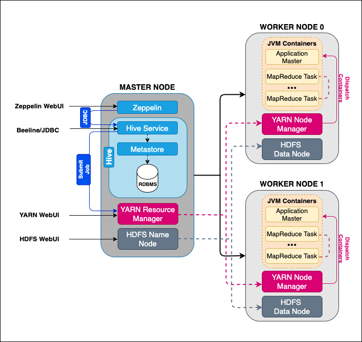
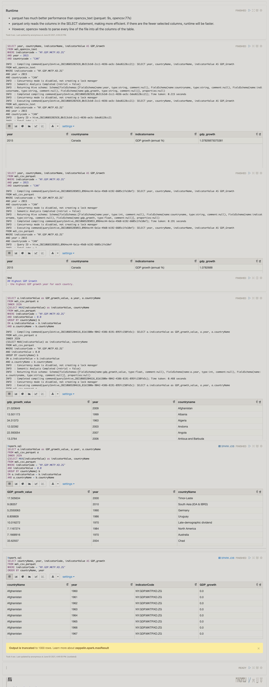

# Hadoop Project
Table of contents
* [Introduction](#Introduction)
* [Hadoop Cluster](#Hadoop-Cluster)
* [Hive Project](#Hive-Project)
* [Improvements](#Improvements)

# Introduction
- The Data Analytics team recently decided to switch to Apache Hadoop to process big data because Hadoop is an entire ecosystem of sophisticated tools used to manage and leverage a distributed information system that can scale to the storage and computational needs of the most ambitious Big Data projects.
- Using Google Cloud Platform, the Hadoop Distributed File System(HDFS) was implemented and with YARN which is a computational resource manager. Apache Hive runs on top of YARN, and it makes users write SQL statements to query data in the cluster. Zeppelin Notebook and Beeline interface were used to interact with Hive. We used The 2016 World Development Indicators dataset(WDI_2016), a 1.8Gb file, stored and analyzed with the Hadoop cluster.
    - Evaluating core Hadoop components (HDFS, YARN, and MapReduce)
    - Provisioning a Hadoop cluster using Google Cloud Platform (GCP)
    - Performing data optimizations/analytics using Apache Hive and Zeppelin Notebook
- As a big data developer:
    - Examined, analyzed data(WDI_2016), checked data processing using the Hadoop ecosystem.
    - Deployed three-node(1 master and 2 workers nodes) Hadoop cluster on GCP and performed data optimizations for data analytics operations by leveraging HDFS, YARN, Hive, and Zeppelin functionality.

# Hadoop Cluster
- The hadoop cluster consisted a master node and two subordinate worker nodes using GCP Dataproc. All three-nodes have the same hardware specifications: 2 vCPUs, 12GB RAM and 100GB HDD.
- Dataproc uses image versions to bundle operating-system, big data components, and GCP connectors into one package deployed on a cluster.

- MASTER NODE
    - A layered application architecture exists in the master node. The lowest layer is the HDFS Name Node, which manages data storage among the HDFS Data Nodes hosted on the worker nodes in the cluster. 
    - YARN Resource Manager coordinates the allocation of computing resources on the cluster. To run the application on YARN, a Client contacts the YARN Resource Manager and asks it to run an application master process. 
    - YARN client can be Apache Hive's Hive Service and passes jobs to the YARN resource manager. A java application that translates Hive Query Language (HQL) commands into something that an execution engine can understand. This conversion of HQL to execution engine tasks is the core functionality of Apache Hive, which is running on our master node. Hive interacts with data in an HDFS much like interacting with an RDBMS through SQL commands and manages table metadata required to serialize and deserialize data to/from tabular objects readable by code and files stored in the HDFS. 
    - A metastore microservice provisions such functionality and uses a dedicated RDBMS to store the table metadata used by Hive. 
    - Users can write HQL queries to Hive using either Beeline or with a notebook-based interface offered by Zeppelin.
    
- WORK NODES
    - HDFS Data Nodes store all the data (the HDFS offers a scalable solution to storing lots of massive files by breaking them up into 128 Mb blocks and storing multiple replications of these blocks over multiple commodity-grade computers so that, Scale data storage horizontally with cheap hardware while also enabling the parallel execution of tasks.)
    - YARN Node Managers launch and monitor the compute containers on machines in the cluster, and each container, a Java Virtual Machine (JVM), can run some program or task needed for the application to function. Once granted containers, the Application manager communicates with the appropriate YARN Node Managers to run their tasks for them.
    
# Hive Project
- WDI 2016 dataset was duplicated onto HDFS from GCP Storage. Hive tables were created from both GCP and HDFS and were used to examine the data, optimize it using SerDes, Partitioning, Columnar-Formats. 
    - SerDes: SerDe is short for Serializer/Deserializer. A SerDe allows Hive to read in data from a table and write it back out to HDFS in any custom format, and Serde treats all columns to be of type String.
    - Partitioning: Partition divides a large amount of data into multiple slices based on the value of a table column. Partitioning has the advantage that queries that are restricted to a particular date or set of dates can run much more efficiently because they only need to scan the files in the partitions that the query pertains to. 
    - Parquet(Columnar-Formats): Parquet stores column-oriented data storage format, where the values of each column are organized so that they are all adjacent, enabling better compression. It is especially good for queries that read particular columns from a wide table.
- [Hive Project](./hive/JarvisHiveProject..ipynb)

# Improvements
- Explore map joins and bucketing techniques in Hive.
- Compare performance MapReduce, Tez, and Spark more in-depth.
- Watching how to keep the distributed system functioning together as a single unit using Zookeeper.
