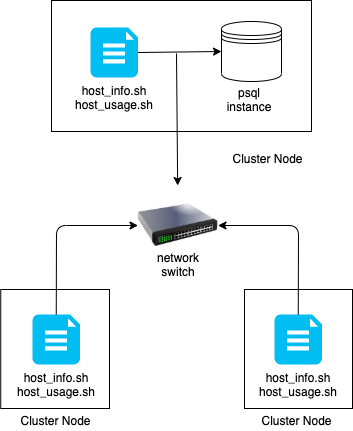

# Introduction
The Linux Cluster Monitoring Agent is an internal tool to monitor the resources used in a network of Linux computers. Every minute, it samples memory and disk usage information for each computer in the cluster and stores the information in a database. To determine statics about the cluster, We made some queries in the database.
The monitoring agent can help the infrastructure team find out whether computers need more or less resource allocation or see if a computer in the network has failed.

# Quick Start
- Start a psql instance using psql_docker.sh
```
    bash psql_docker_01.sh create/start/stop/remove/check [db_password] [db_username]
```
- Create tables using ddl.sql
```
    psql -h localhost -U postgres -d host_agent -f sql/ddl.sql
```
- Insert hardware specs data into the db using host_info.sh
```
    bash host_info.sh localhost 5432 host_agent postgres password
```
- Insert hardware usage data into the db using host_usage.sh
```
    1. bash host_usage.sh localhost 5432 host_agent postgres password
    2. use in crontab
```
- Crontab setup
```$xslt
    Every computer can monitor it
    crontab -e
    * * * * * bash /path/to/directory/scripts/host_usage.sh localhost 5432 host_agent [db_username] [db_password]
```

# Implementation
1. create functions that can reuse anytime.
2. use a list that can easy to modify in the future.

## Architecture


## Scripts
1. psql_docker.sh

|DESCRIPTION|depending on the command, run a shell script.|
|---|---|
|COMMAND|command='create' 'start' 'stop' 'remove' 'check'|
|HOW TO RUN|bash psql_docker.sh [command] [password] [db_username]|

2. host_info.sh

|DESCRIPTION|checking the table exists or not, and adding a row.|
|---|---|
|HOW TO RUN|bash host_info.sh [psql_host] [psql_port] [db_name] [db_username] [db_password]|

3. host_usage.sh

|DESCRIPTION|checking the table exists or not, and adding a row.|
|---|---|
|HOW TO RUN|bash host_usage.sh [psql_host] [psql_port] [db_name] [db_username] [db_password]|

4. crontab

|DESCRIPTION|checking the table exists or not, and adding a row.|
|---|---|
|HOW TO RUN|crontab -e| 
| |* * * * * bash path/to/directory/scripts/host_usage.sh [psql_host] [psql_port] [db_name] [db_username]|

## Database Modeling
Describe the schema of each table using markdown table syntax (do not put any sql code)
- `host_info`
- `host_usage`
- `ddl`
- `queries`

* host_info

|Column|Description|
|---|---|
|`id`|ID number of host|
|`hostname`|Name of host. `hostname` must have an unique value|
|`cpu_number`|Number of CPUs|
|`cpu_architecture`|Architecture of CPUs|
|`cpu_model`|Model of CPUs|
|`cpu_mhz`|Clock speed of CPUs in MHz|
|`l2_cache`|Size of L2 cache in KB|
|`total_mem`|Size of RAM|
|`time_`|Timestamp(UTC)|

* a sample of host_info

|id|hostname|cpu_number|cpu_architecture|cpu_model|cpu_mhz|L2_cache|total_mem|time_|
| :---: | :---: | :---: | :---: | :---: | :---: | :---: | :---: | :---: |
|1|hostname|1|x86_64|Intel(R) Xeon(R) CPU @ 2.30GHz|2300.000|256|751324| 2021-03-16 16:58:58|

* host_usage 

|Column|Description|
|---|---|
|`time_`|Timestamp(UTC)|
|`host_id`|ID number of host. Get id from host_info |
|`memory_free`|the free memory of host|
|`cpu_idle`|the CPU idle percentage|
|`cpu_kernel`|The CPU percentage runs in the kernel|
|`disk_io`|Number of I/O operations performed on the disk|

* a sample of host_usage

|time_| host_id | memory_free | cpu_idle  | cpu_kernel | disk_io | disk_available|
| :---: | :---: | :---: | :---: | :---: | :---: | :---: | 
|2021-03-16 18:26:58|1|30000|95|0|45 |23439|

# Test
- `host_info` : set up the information about host information and add a row.
- `host_usage`: set up the information about host usage and add a row.
- `ddl`       : create tables which are host_info, and host_usage.
- `queries`   : able to run some queries
                (Total memory info, Average memory usage, Detect host failure) 
                and show the results.
                
# Improvements
- Create a script to update the host_info database whenever a computer has its hardware modified.
- Fix the issue where a failure is reported when the crontab job starts in the last 2 minutes of a 5-minute interval.
- Create a file to run all functions at once.

