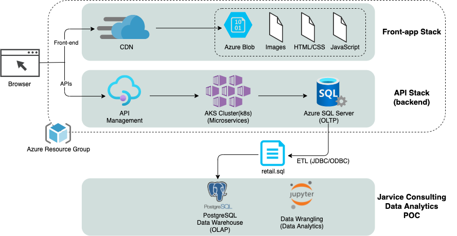
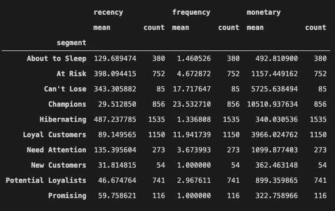

# Introduction
- London Gift Shop(LGS) is a UK-based online store that sells gift-ware and has been operating for more than 10 years. However, revenue has not grown recently. So, LGS wants to understand their customers to develop sales and marketing techniques using the latest data. LGS has requested this project to Jarvis consulting because the LGS marketing team does not have IT resources to carry out this project. This project aims to deliver meaningful data to answer the business questions posed by LGS, a UK-based online store trying to improve the growth rate of their revenue.
- I got a SQL file and loaded it into a PostgreSQL dockerized instance that served as the data warehouse, and I analyzed LGS sales data to answer multiple business questions. To perform analysis, I used Numpy, Matplotlib, Pandas DataFrame and Jupyter Notebook to perform OLAP operations(data ingestion, data transaction, data processing, data visualization and so on) on the data. I also used RFM segmentation for analyzing customer value.

# Implementaion
## Project Architecture
- LGS(London Gift Shop) uses Microsoft Azure as a cloud-based solution to hardware and information system architecture provisioning for both front and back ends of the web application. The unstructured data used to render their web pages is managed with Azure Blob storage solution and made available to clients with a Content Distribution System. Transactional operations executed by clients through APIs are processed by a microservice-based backend application developed with Kubernetes, which performs the requested transactions on the SQL Server database.
- We cannot access the database directly because our project is Poc. Instead, We are using Transaction data between 2009-12 and 2011-12 into an SQL file that can be loaded into a data warehouse(PostgresSQL instance) and used to perform OLAP(Online Transaction Processing) operations.

## Data Analytics and Wrangling
- Create a link that points to your Jupyter notebook (use the relative path `./retail_data_analytics_wrangling.ipynb`)
- Discuss how would you use the data to help LGS to increase their revenue (e.g. design a new marketing strategy with data you provided)

This Jupyter Notebook presents the data wrangling on the retail data provided by LGS to answer the following business questions:
- Total Invoice Amount Distribution
- Monthly Placed and Cancelled Orders
- Monthly Sales
- Monthly Sales Growth
- Monthly Active Users
- Monthly New and Existing Users
- RFM segments

RFM stands for Recency, Frequency, and Monetary.
- Recency – How recently did the customer purchase?
- Frequency – How often do they purchase?
- Monetary Value – How much do they spend?

RFM Segmentation allows marketers to gain an extensive understanding of their customers by analyzing those 3 quantifiable factors
it is a way to analyze customer value.

I have paid special attention to 3 segments to increase revenue:
1. Can't Lose
    - Number of customers: 85
    - Last shopping date on average: 343 days ago
    - Average number of purchases: 18
    - Average money spent: £5726
    - Customers in this segment have not recently made a purchase. However, they made a large number of purchases in the past. So, it is essential to investigate why they have lower numbers of purchased products than before.
    
2. Hibernating
    - Number of customers: 1535
    - Last shopping date on average: 487 days ago
    - Average number of purchases: 1
    - Average money spent: £340
    - Customers in this segment have not purchased in a long time. It needs to consider some events that can motivate purchasing products.
    
3. Champions
    - Number of customers: 856
    - Last shopping date on average: 30 days ago
    - Average number of purchases: 24
    - Average money spent: £10511
    - Customers in this segment are responsible for most of the revenue. So, it is important to track what kinds of products they usually purchased and provide VIP events to keep customers.

# Improvements
- Compare competitors.
- Check the best/worst items.
- Check what kind of products customers from other countries want to buy.