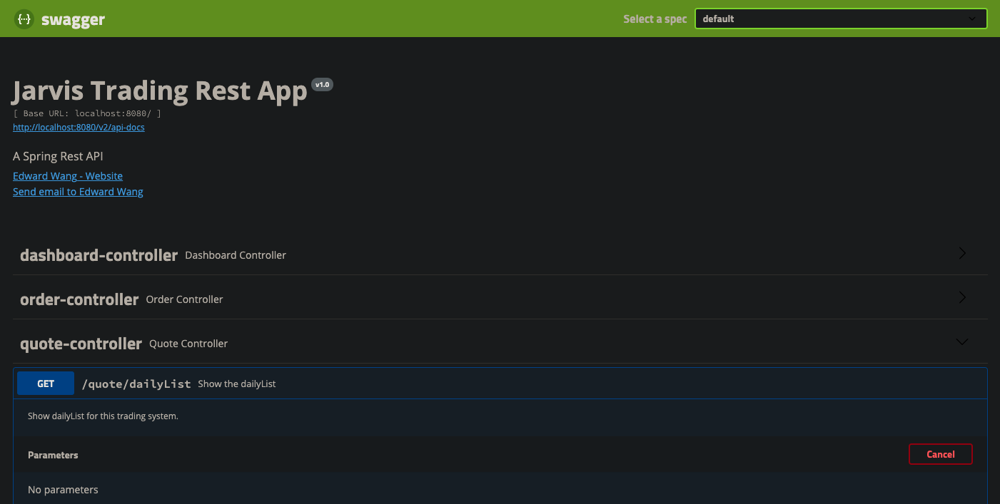
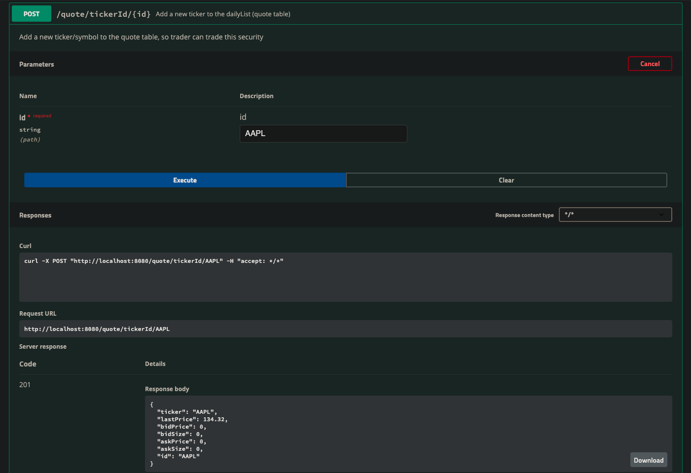
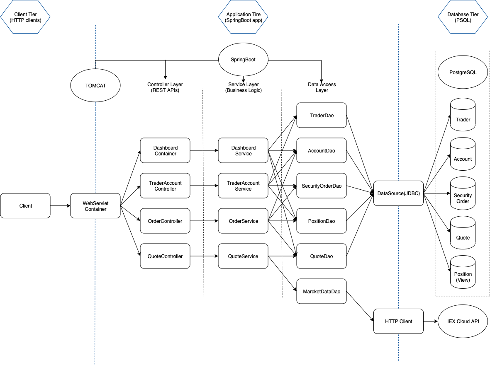
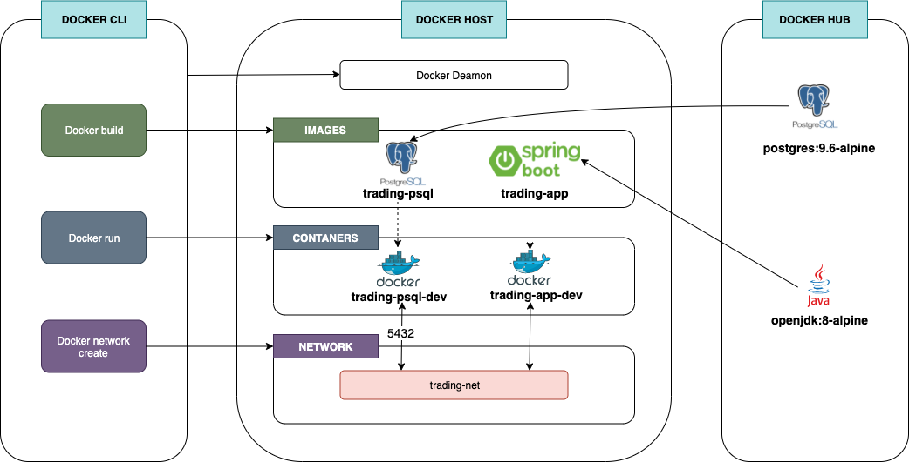

Table of contents
* [Introduction](#Introduction)
* [Quick Start](#Quick&nbsp;Start)
* [Architecture](#Architecture)
* [REST API Usage](#REST&nbsp;API&nbsp;Usage)
* [Test](#Test)
* [Deployment](#Deployment)
* [Improvements](#Improvements)

# Introduction
This application is an online stock trading simulator using a REST API that returns JSON documents to users. It retrieves the real stock market information using IEX Cloud API(IEX Cloud has delayed stock information), saves and persists data into a database. And, this application allows users to manage client profiles and accounts, monitor portfolio performance, and trade securities. 
The application is a Microservice backend that is implemented using Java and Springboot with a PSQL database. The application follows MVC and 3-tier architecture.

# Quick Start
- Prequiresites: Docker, CentOS 7
- Docker scripts with description
	- build images
        ```shell script
        # psql image - make sure you are in the psql directory
        docker build -t traading-psql .
        # app image - make sure you are in the root directory
        docker build -t trading-app .
        ```
  - create a docker network
    ```shell script
    # create a network to communicate between both containers
    docker network create --driver bridge trading-net
    ```
  - start containers
    ```shell script
    # Start PSQL container
    docker run --name trading-psql-dev \
    -e POSTGRES_PASSWORD=password \
    -e POSTGRES_DB=jrvstrading \
    -e POSTGRES_USER=postgres \
    --network trading-net \
    -d -p 5432:5432 trading-psql
    
    # Set IEX Token (from your IEX Cloud account)
    IEX_PUB_TOKEN=your_token
    
    # Start application container
    docker run --name trading-app-dev \
    -e "PSQL_URL=jdbc:postgresql://trading-psql-dev:5432/jrvstrading" \
    -e "PSQL_USER=postgres" \
    -e "PSQL_PASSWORD=password" \
    -e "IEX_PUB_TOKEN=${IEX_PUB_TOKEN}" \
    --network trading-net \
    -p 8080:8080 trading-app
    ```
-  SWAGGER UI: http://localhost:8080/swagger-ui.html


# Implemenation
## Architecture


  - Controller layer 
    - The controller layer handles HTTP requests and calls the service layer with given input (handles HTTP requests using Tomcat) and controls exceptions thrown by the app at the HTTP level.
  - Service layer
    - The service layer handles business logic, validates data passed down from the controller layer, and calls corresponding functionality in the DAO layer.
  - DAO layer
    - The DAO layer handles data storage and performs the actual data manipulation. The DAOs make calls to access the PSQL instances through the DataSource class. It also accesses an external REST API to retrieve data from IEX.
  - SpringBoot:
    - SpringBoot manages class dependencies automatically through IoC. Apache Tomcat is the default web servlet in Springboot, provides a Java HTTP web server environment that automatically handles REST API calls from clients.
  - PSQL and IEX
    - PSQL provides the data storage platform to store the data, and IEX cloud's REST API provides the real stock market data source.

## REST API Usage
### Swagger
Swagger is a set of open-source tools built around the OpenAPI Specification that can help you design, build, document and consume REST APIs. Also,  This tool assists in the entire development cycle of the API. Users can try out the API calls directly in the browser because It provides interactive API documentation. Through this function, it makes it easy for developers to test the API on HTTP clients.
### Quote Controller
- This controller handles HTTP requests that accept stock quotes to and from IEX Cloud and the PSQL instance. Stock market data is retrieved from the IEX Cloud and persisted in the PSQL instance.
  - GET `/quote/dailyList`: list all securities that are available to trading in this trading system.
  - GET `/quote/iex/ticker/{ticker}`: retrieves data for a specific quote from IEX Cloud using ticker.
  - POST `/quote/tickerId/{tickerId}`: retrieves a specific quote with a given ticker from IEX and stores it in the database.
  - PUT `/quote/`: updates a quote object requested body in the database without using IEX Cloud.
  - PUT `/quote/iexMarketData`: updates all quotes in the database using IEX Cloud.
### TraderAccount Controller
- This controller handles HTTP requests that trader data to and from the PSQL instance.
    - POST `/trader/`: creates a trader and an account with a given trader object information from the requested body(JSON Format). The amount is 0 as the default setting.
    - POST `/trader/firstName/{firstName}/lastName/{lastName}/dob/{dob}/country/{country}/email/{email}`: creates a trader and an account with @PathVariable that allows pass info in the URL.
    - PUT `/trader/deposit/traderId/{traderId}/amount/{amount}`: deposits funds to an account associated with the given traderId, and the fund amount must be greater than 0.
    - PUT `/trader/withdraw/traderId/{traderId}/amount/{amount}`: withdraws funds to an account associated with the given traderId, and the amount must be greater than funds.
    - DELETE `/trader/traderId/{traderId}`: deletes a trader if the account amount is 0 and has no open positions also removes the associated account and security orders.
### Order Controller
- This controller handles HTTP requests that security order data in the PSQL instance.
    - POST `/order/marketOrder/`: It creates a security order with the given market order object requested body into PSQL instance(selling market order if the size has a negative value. if not, buying market order).
### Dashboard controller
- This controller handles HTTP requests that read only data from the PSQL instance(it shows PortfolioView and TraderAccountView).
    - GET `/profile/traderId/{traderId}`: shows the trader and associated account by traderId.
    - GET `/portfolio/traderId/{traderId}`: It shows all positions that trader requested order have been filed(it shows all the tickers with the stock size that trader has).

# Test 
Junit: testing each class independently using Junit4.
Mockito: If classes had any dependencies, the Mockito framework was used to mock the dependency's behaviours.

# Deployment

- Dockerfile:
    ```shell script
    # all scripts placed under `/docker-entrypoint-initdb.d/` are run when the container is started;
    # PSQL dockerfile executes copying SQL files and initializing the database and tables.
    FROM postgres:9.6-alpine
    COPY /sql_ddl/init_db.sql /sql_ddl/schema.sql /docker-entrypoint-initdb.d/
    ```
- Build images:
    ```shell script
    # psql image - make sure you are in the psql directory
    docker build -t traading-psql .
    # app image - make sure you are in the root directory
    docker build -t trading-app .
    ```
- Create docker network:
    ```shell script
    # network helps to communicate among containers
    docker network create --driver bridge trading-net
    ```
- Start containers:
    ```shell script
    # start the psql container from the trading-psql image and attach it to the trading-net network
    docker run --name trading-psql-dev \
    -e POSTGRES_PASSWORD=password \
    -e POSTGRES_USER=postgres \
    --network trading-net \
    -d -p 5432:5432 trading-psql
     
    #set token
    IEX_PUB_TOKEN="your_token"
    
    #start trading-app container which is attached to the trading-net docker network
    #make sure that trading-psql is running
    docker run --name trading-app-dev \
    -e "PSQL_URL=jdbc:postgresql://trading-psql-dev:5432/jrvstrading" \
    -e "PSQL_USER=postgres" \
    -e "PSQL_PASSWORD=password" \
    -e "IEX_PUB_TOKEN=${IEX_PUB_TOKEN}" \
    --network trading-net \
    -p 5000:5000 -t trading-app
    ```
- Push/pull images to Docker Hub
    ```shell script
    #tag the images before pushing
    docker tag trading-psql anyerin01/trading-psql
    docker tag trading-app anyerin01/trading-app
    
    #push images
    docker push anyerin01/trading-psql
    docker push anyerin01/trading-app
    
    #pull images
    docker pull anyerin01/trading-psql
    docker pull anyerin01/trading-app
    ```
# Improvements
- Allow for multiple orders to be processed in one API request.
- Implement token authentication function on the swagger page.
- Automatically update quote data(last price) every minute from IEX Cloud.